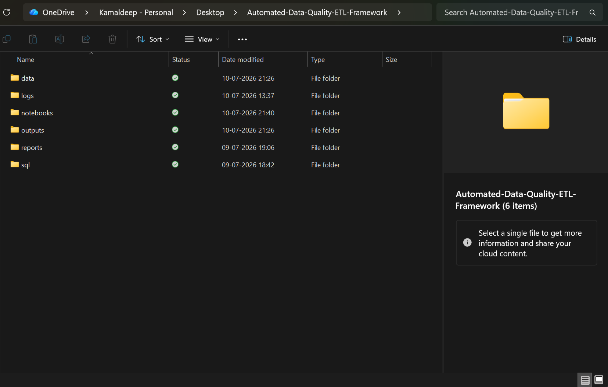
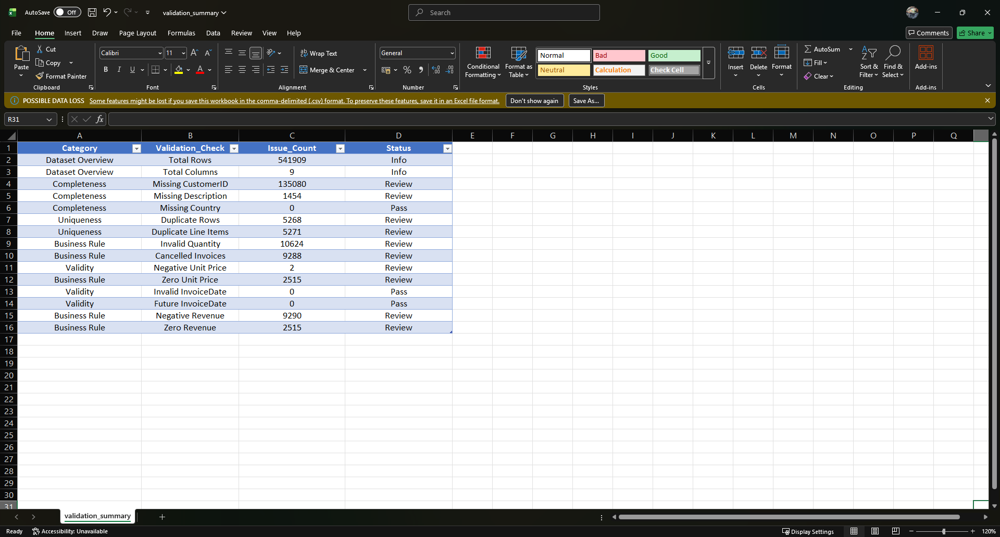
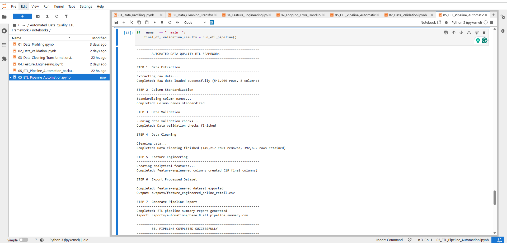
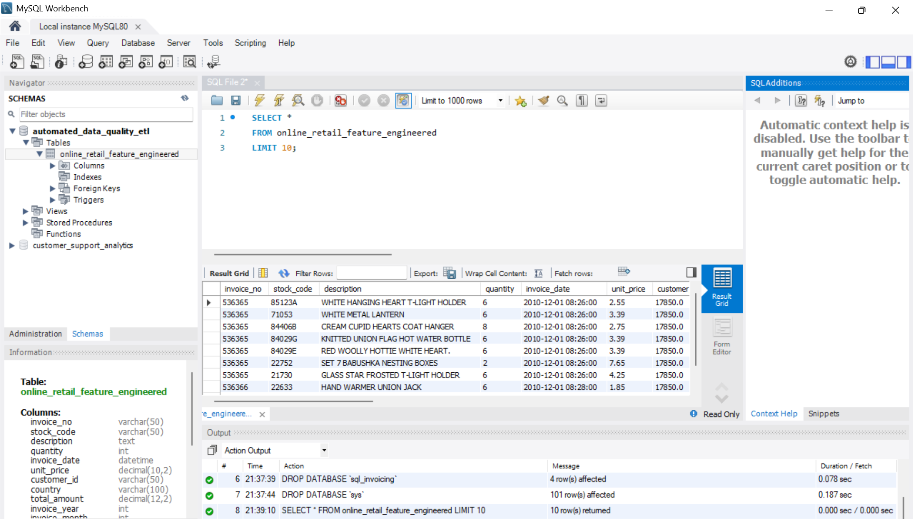
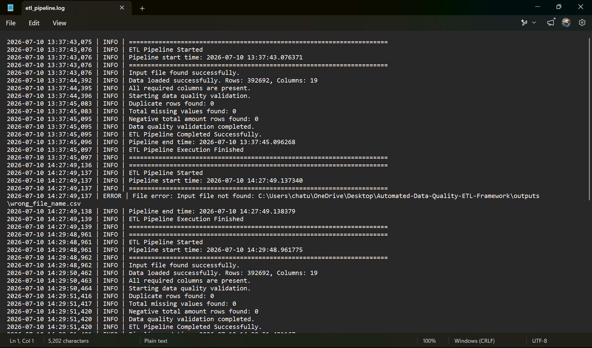

# Automated Data Quality & ETL Framework


## Project Overview

The **Automated Data Quality & ETL Framework** is an end-to-end data engineering project that automates the process of extracting, validating, cleaning, transforming, and loading retail transaction data into a MySQL database. The framework demonstrates how raw business data can be converted into reliable, analytics-ready datasets through a structured ETL pipeline.

The project was developed using the **Online Retail Dataset** from the **UCI Machine Learning Repository** and follows production-inspired ETL practices, including automated data validation, feature engineering, SQL analytics, logging, and error handling.

Unlike a simple data cleaning notebook, this project simulates how real-world ETL pipelines operate by emphasizing data quality, reproducibility, modular design, and maintainability.

---

# Project Objectives

The primary objectives of this project are:

- Build a complete ETL workflow using Python and MySQL.
- Automate data validation before processing.
- Clean and standardize inconsistent retail transaction data.
- Engineer analytical features for business reporting.
- Store processed data inside a relational database.
- Perform SQL-based analytical reporting.
- Implement production-style logging and error handling.
- Organize the project using professional GitHub repository standards.

---

# Key Features

- Automated data extraction from Excel files.
- Data profiling and exploratory analysis.
- Comprehensive data quality validation.
- Missing value detection and handling.
- Duplicate record identification.
- Business rule validation.
- Data cleaning and transformation.
- Feature engineering for analytics.
- Automated ETL pipeline execution.
- MySQL database integration.
- SQL analytics and reporting.
- SQL views and stored procedures.
- Production-style logging.
- Exception handling and pipeline monitoring.
- Modular and maintainable project structure.

---

# Technology Stack

| Category | Technology |
|----------|------------|
| Programming Language | Python 3.13 |
| Database | MySQL Workbench 8.0.42 |
| Libraries | Pandas, NumPy, OpenPyXL, Logging |
| Development Environment | Jupyter Notebook |
| Data Source | UCI Machine Learning Repository |
| Version Control | Git & GitHub |

---

# Dataset Information

**Dataset Name**

Online Retail Dataset

**Source**

UCI Machine Learning Repository

**Dataset Description**

The dataset contains transactional records of a UK-based online retail company. Each row represents an individual product purchased within an invoice.

The original dataset contains information such as:

- Invoice Number
- Product Code
- Product Description
- Quantity
- Invoice Date
- Unit Price
- Customer ID
- Country

This dataset is widely used for:

- Retail Analytics
- Customer Analytics
- Sales Analysis
- ETL Demonstrations
- Data Quality Projects
- Business Intelligence

---

# ETL Workflow

The framework follows the traditional ETL lifecycle.

```text
                Raw Excel Dataset
                        │
                        ▼
              Data Profiling & Exploration
                        │
                        ▼
              Data Validation Checks
                        │
                        ▼
           Data Cleaning & Transformation
                        │
                        ▼
               Feature Engineering
                        │
                        ▼
             Automated ETL Pipeline
                        │
                        ▼
              Load into MySQL Database
                        │
                        ▼
            SQL Analytics & Reporting
                        │
                        ▼
          Logging & Error Monitoring
```

Each stage is modular, making the framework easier to maintain, debug, and extend.

---

# Project Architecture

```text
             Online Retail Dataset
                      │
                      ▼
          Python Data Profiling Module
                      │
                      ▼
         Python Data Validation Module
                      │
                      ▼
     Data Cleaning & Transformation Module
                      │
                      ▼
         Feature Engineering Module
                      │
                      ▼
          Automated ETL Pipeline
                      │
          ┌───────────┴───────────┐
          ▼                       ▼
     CSV Outputs             MySQL Database
          │                       │
          ▼                       ▼
    SQL Analytics          Views & Procedures
          │
          ▼
 Logging & Error Handling
```

The architecture separates every stage of the ETL lifecycle into independent modules, making the project scalable and easy to maintain.

---

# Project Folder Structure

```text
Automated-Data-Quality-ETL-Framework
│
├── data
│   └── raw
│       └── Online Retail.xlsx
│
├── notebooks
│   ├── 01_Data_Profiling.ipynb
│   ├── 02_Data_Validation.ipynb
│   ├── 03_Data_Cleaning_Transformation.ipynb
│   ├── 04_Feature_Engineering.ipynb
│   ├── 05_ETL_Pipeline_Automation.ipynb
│   └── 09_Logging_Error_Handling.ipynb
│
├── outputs
│   ├── cleaned_online_retail_data.csv
│   └── feature_engineered_online_retail.csv
│
├── reports
│   ├── automation
│   ├── cleaning
│   ├── validation
│   ├── images
│   ├── data_profiling_report.html
│   └── sample_preview.csv
│
├── sql
│   ├── analytics_data_quality
│   └── mysql_load
│
├── logs
│   └── etl_pipeline.log
│
├── requirements.txt
├── .gitignore
└── README.md
```

The repository follows a modular directory structure that separates source data, notebooks, reports, SQL scripts, outputs, logs, and documentation. This organization improves readability, maintainability, and ease of collaboration.

---

# Repository Structure

Below is the actual project structure after completing all development phases.



The repository is organized into dedicated folders for each component of the ETL framework. Source data, notebooks, SQL scripts, reports, generated outputs, logs, and documentation are separated to maintain a clean and scalable project layout. This structure makes the project easy to navigate and simplifies future enhancements or collaboration.

---

# Project Phases

The project was developed in ten sequential phases:

| Phase | Description |
|--------|-------------|
| Phase 1 | Data Profiling |
| Phase 2 | Data Validation |
| Phase 3 | Data Cleaning & Transformation |
| Phase 4 | Feature Engineering |
| Phase 5 | ETL Pipeline Automation |
| Phase 6 | Load Processed Data into MySQL |
| Phase 7 | SQL Analytics & Data Quality |
| Phase 8 | ETL Pipeline Execution |
| Phase 9 | Logging & Error Handling |
| Phase 10 | Documentation & GitHub Packaging |

Each phase builds upon the previous one, resulting in a complete, production-inspired ETL framework.


# Phase 1 – Data Profiling

The first phase of the project focuses on understanding the structure and quality of the raw dataset before any transformation takes place. Profiling helps identify inconsistencies, missing values, duplicate records, incorrect data types, and potential business issues that could affect downstream analytics.

During this phase, the Online Retail dataset was imported into Python using Pandas, and an exploratory analysis was performed to understand the characteristics of the data.

### Activities Performed

- Loaded the raw Excel dataset.
- Inspected the dataset dimensions.
- Reviewed column names and data types.
- Identified missing values.
- Detected duplicate records.
- Generated descriptive statistics.
- Examined categorical and numerical distributions.
- Generated a comprehensive HTML profiling report.

### Output Generated

```
reports/
└── data_profiling_report.html
```

This report provides an overview of dataset quality and serves as the foundation for the subsequent validation and cleaning stages.

---

# Phase 2 – Data Validation

After understanding the dataset, the next step was validating the data against predefined quality rules. This ensures that invalid records are detected before entering the transformation stage.

The validation framework was designed to automatically evaluate multiple data quality dimensions including completeness, uniqueness, validity, and business rule compliance.

### Validation Checks Implemented

#### Dataset Overview

- Total Rows
- Total Columns

#### Completeness Checks

- Missing Customer IDs
- Missing Product Descriptions
- Missing Country Values

#### Uniqueness Checks

- Duplicate Rows
- Duplicate Line Items

#### Business Rule Checks

- Invalid Quantity Values
- Cancelled Invoices
- Negative Revenue
- Zero Revenue
- Zero Unit Price

#### Validity Checks

- Negative Unit Price
- Invalid Invoice Dates
- Future Invoice Dates

Each validation rule produces a summary indicating whether the dataset passes the check or requires further review.

### Validation Outputs

```
reports/
└── validation/
    ├── validation_summary.csv
    ├── validation_detailed_report.csv
    └── data_types_reference.csv
```

### Validation Summary



The validation summary provides a consolidated overview of all implemented data quality rules. Rather than stopping the pipeline immediately, the framework highlights issues that require attention while allowing further processing where appropriate. This mirrors real-world ETL practices, where data quality reports are generated for review before business decisions are made.

---

# Phase 3 – Data Cleaning & Transformation

Once the validation phase identified quality issues, the dataset entered the cleaning and transformation stage. The objective of this phase was to standardize the dataset while preserving valuable business information.

Cleaning operations were designed to improve consistency, accuracy, and usability without altering the meaning of the original data.

### Cleaning Activities

- Standardized column names.
- Removed duplicate records.
- Removed invalid quantity values.
- Handled missing descriptions.
- Converted data types.
- Standardized date formats.
- Removed invalid transactions.
- Prepared the dataset for analytical processing.

The cleaned dataset became the foundation for feature engineering and database loading.

### Output Generated

```
outputs/
└── cleaned_online_retail_data.csv
```

Additionally, a cleaning summary was generated to document all transformations performed during this stage.

```
reports/
└── cleaning/
    └── phase_4_cleaning_summary.csv
```

---

# Phase 4 – Feature Engineering

After cleaning the dataset, additional business-oriented features were created to improve analytical capabilities.

Instead of relying only on the original transactional fields, several derived columns were generated to simplify reporting and enable richer business insights.

### Engineered Features

The following analytical features were created:

- Total Transaction Amount
- Invoice Year
- Invoice Month
- Invoice Day
- Invoice Hour
- Day of Week
- Weekend Indicator
- Revenue Category
- Quantity Category
- Unit Price Category
- Customer Type

These engineered attributes simplify SQL analysis and business reporting while reducing repetitive calculations during downstream analytics.

### Output Generated

```
outputs/
└── feature_engineered_online_retail.csv
```

The final dataset contains both the original transaction data and engineered features required for advanced analytics.

---

# Phase 5 – ETL Pipeline Automation

After completing the individual processing stages, the entire workflow was automated into a reusable ETL pipeline.

Rather than executing multiple notebooks manually, the pipeline performs all processing stages sequentially.

### Automated Pipeline Flow

1. Read raw dataset.
2. Standardize column names.
3. Execute validation checks.
4. Clean the dataset.
5. Generate engineered features.
6. Export processed dataset.
7. Generate ETL summary report.

The automated workflow significantly reduces manual intervention while ensuring consistent processing every time the pipeline is executed.

### ETL Pipeline Output

The pipeline generates:

```
outputs/
└── feature_engineered_online_retail.csv
```

and

```
reports/
└── automation/
    └── phase_8_etl_pipeline_summary.csv
```

### ETL Pipeline Execution



The execution log displayed above demonstrates the automated processing of the dataset from extraction through feature engineering and report generation. Each stage is executed sequentially, providing clear visibility into the progress of the ETL workflow. This structured execution improves reproducibility and makes the pipeline easier to monitor, troubleshoot, and maintain.

---

# Phase 1–5 Summary

The first half of the project establishes a robust data preparation framework by transforming raw transactional data into a structured, analytics-ready dataset.

Key accomplishments include:

- Automated data profiling.
- Comprehensive data validation.
- Standardized data cleaning.
- Business-focused feature engineering.
- End-to-end ETL pipeline automation.

These phases ensure that only validated, cleaned, and enriched data progresses to the database layer, providing a reliable foundation for SQL analytics and reporting.

# Phase 6 – Loading Processed Data into MySQL

Once the dataset had been cleaned and enriched with analytical features, the next stage involved loading the processed data into a relational database for querying and reporting.

MySQL was selected because it is one of the most widely used relational database management systems in data engineering and analytics projects.

The processed CSV generated by the ETL pipeline was imported into MySQL using SQL scripts designed specifically for database initialization and verification.

## MySQL Loading Workflow

The loading process consists of five structured steps:

1. Create the project database.
2. Create the destination table.
3. Import the feature-engineered dataset.
4. Verify successful data loading.
5. Perform initial data quality checks.

The loading process ensures that the transformed dataset is available for SQL analysis without requiring manual intervention.

---

# MySQL Loading Scripts

The SQL scripts used for database initialization are organized inside the **mysql_load** directory.

```text
sql/
└── mysql_load/
    ├── 01_create_database.sql
    ├── 02_create_table.sql
    ├── 03_load_feature_engineered_data.sql
    ├── 04_verify_load.sql
    └── 05_initial_data_quality_checks.sql
```

### Script Descriptions

### 01_create_database.sql

Creates the project database used throughout the SQL analytics phase.

### 02_create_table.sql

Creates the destination table with the required schema and appropriate data types.

### 03_load_feature_engineered_data.sql

Imports the feature-engineered CSV generated by the ETL pipeline into MySQL.

### 04_verify_load.sql

Validates that the dataset has been successfully imported by querying sample records and row counts.

### 05_initial_data_quality_checks.sql

Executes several SQL validation queries to confirm that the imported data maintains integrity after loading.

---

# MySQL Database

After completing the loading process, the processed dataset is stored inside the MySQL database and becomes the primary source for SQL analytics.



The screenshot above demonstrates the successfully loaded feature-engineered dataset inside MySQL Workbench. This verifies that the ETL pipeline successfully transferred the processed data from Python into a relational database.

---

# Phase 7 – SQL Analytics & Data Quality

With the processed dataset available in MySQL, SQL was used to perform business analytics and validate data quality from a database perspective.

Rather than relying only on Python, this phase demonstrates how SQL can be used to answer business questions, summarize operational metrics, and verify the consistency of stored data.

The analytical scripts cover fundamental SQL concepts as well as advanced querying techniques.

---

# SQL Analytics Modules

The SQL scripts are organized into the following categories:

```text
sql/
└── analytics_data_quality/
```

The modular organization allows each analytical topic to be maintained independently.

---

# SQL Analytics Scripts

## 01_business_kpis_eda.sql

This script focuses on exploratory analysis and business KPIs.

Examples include:

- Total Revenue
- Total Orders
- Average Order Value
- Average Quantity Sold
- Customer Count
- Country Distribution

These metrics provide a high-level overview of business performance.

---

## 02_aggregate_groupby_having.sql

This script demonstrates aggregation techniques using:

- GROUP BY
- HAVING
- COUNT()
- SUM()
- AVG()
- MIN()
- MAX()

Business summaries are generated across countries, products, months, and customers.

---

## 03_customer_product_revenue_analysis.sql

Customer and product performance are analyzed using SQL.

Examples include:

- Highest Revenue Customers
- Best Selling Products
- Revenue by Country
- Revenue by Customer
- Monthly Sales Performance

These analyses help identify the most valuable customers and products.

---

## 04_time_series_analysis.sql

Time-based analysis is performed using the engineered date attributes.

Examples include:

- Revenue by Year
- Revenue by Month
- Daily Sales Trends
- Hourly Sales Patterns
- Weekend vs Weekday Sales

These reports demonstrate how engineered temporal features simplify business reporting.

---

## 05_subqueries_ctes_window_functions.sql

This script demonstrates advanced SQL concepts.

Topics covered include:

- Subqueries
- Common Table Expressions (CTEs)
- Window Functions
- ROW_NUMBER()
- RANK()
- DENSE_RANK()
- Running Totals
- Revenue Rankings

These techniques are frequently used in production analytics environments.

---

## 06_sql_data_quality_validation.sql

This script performs database-level validation.

Checks include:

- Duplicate Records
- Missing Values
- Invalid Revenue
- Zero Revenue
- Quantity Validation
- Customer Validation

Running these checks inside MySQL confirms that data integrity has been preserved throughout the ETL process.

---

## 07_views.sql

Several reusable SQL Views were created to simplify business reporting.

Views reduce query complexity and allow analysts to retrieve frequently used summaries without rewriting large SQL statements.

Examples include:

- Customer Revenue Summary
- Product Revenue Summary
- Monthly Sales Summary
- Country Sales Summary

---

## 08_stored_procedures.sql

Stored procedures automate commonly executed analytical queries.

Benefits include:

- Reusable SQL logic
- Simplified reporting
- Parameterized execution
- Improved maintainability

These procedures can be called directly from reporting tools or applications.

---

# SQL Skills Demonstrated

This project demonstrates practical experience with:

- SELECT Statements
- WHERE Clause
- ORDER BY
- GROUP BY
- HAVING
- Aggregate Functions
- CASE Statements
- Date Functions
- Joins
- Subqueries
- Common Table Expressions (CTEs)
- Window Functions
- Views
- Stored Procedures
- Data Quality Validation
- Business KPI Reporting

---

# SQL Analytics Summary

The SQL component of this project transforms the processed dataset into actionable business insights.

By combining descriptive analytics, advanced querying techniques, reusable views, and stored procedures, the project demonstrates a complete analytical workflow similar to those used in enterprise reporting environments.

This phase highlights the integration between Python-based ETL processing and SQL-based business analytics, illustrating how clean and validated data can be leveraged to support decision-making through efficient database queries.

# Phase 8 – ETL Pipeline Execution

After developing the individual ETL components, the complete workflow was integrated into a single automated pipeline. This pipeline executes each stage sequentially with minimal user intervention, ensuring that the same processing logic is applied consistently every time the dataset is processed.

The automated pipeline performs the following tasks:

1. Reads the raw Excel dataset.
2. Standardizes column names.
3. Executes data validation checks.
4. Cleans and transforms the dataset.
5. Creates analytical features.
6. Exports the processed dataset.
7. Generates execution reports.
8. Records pipeline activity through logging.

The automation significantly reduces manual effort while improving consistency, reproducibility, and maintainability.

---

# Phase 9 – Logging & Error Handling

A production-inspired logging framework was implemented to monitor every stage of the ETL process.

Rather than relying solely on console output, the framework records execution details in a dedicated log file, making it easier to monitor pipeline execution, troubleshoot failures, and maintain auditability.

## Logging Features

The logging system records:

- Pipeline start and completion
- Dataset loading
- Validation progress
- Cleaning operations
- Feature engineering
- Output generation
- Error messages
- Exception details
- Execution timestamps

The project uses Python's built-in `logging` module to create timestamped log entries with different severity levels.

Typical log levels include:

- INFO
- ERROR

An intentional error scenario was also tested to verify that exceptions are correctly captured and recorded in the log file.

---

# ETL Pipeline Log



The log demonstrates successful execution of the ETL pipeline while also capturing an intentionally generated error during testing. This confirms that the logging framework is capable of monitoring execution progress, recording failures, and supporting troubleshooting activities.

---

# Project Outputs

Executing the complete ETL pipeline generates the following outputs.

## Processed Dataset

```
outputs/
└── feature_engineered_online_retail.csv
```

## Cleaned Dataset

```
outputs/
└── cleaned_online_retail_data.csv
```

## Validation Reports

```
reports/
└── validation/
    ├── validation_summary.csv
    ├── validation_detailed_report.csv
    └── data_types_reference.csv
```

## Cleaning Report

```
reports/
└── cleaning/
    └── phase_4_cleaning_summary.csv
```

## Automation Report

```
reports/
└── automation/
    └── phase_8_etl_pipeline_summary.csv
```

## Profiling Report

```
reports/
└── data_profiling_report.html
```

## ETL Log

```
logs/
└── etl_pipeline.log
```

---

# Installation Guide

## Clone the Repository

```bash
git clone https://github.com/your-username/Automated-Data-Quality-ETL-Framework.git
```

Move into the project directory.

```bash
cd Automated-Data-Quality-ETL-Framework
```

---

## Install Required Libraries

```bash
pip install -r requirements.txt
```

---

## Configure MySQL

1. Install MySQL Workbench 8.0.42 or later.
2. Create a local MySQL connection.
3. Execute the SQL scripts located in:

```
sql/mysql_load/
```

to create the database and tables.

---

## Execute the Project

Run the notebooks in the following order:

```
01_Data_Profiling.ipynb

↓

02_Data_Validation.ipynb

↓

03_Data_Cleaning_Transformation.ipynb

↓

04_Feature_Engineering.ipynb

↓

05_ETL_Pipeline_Automation.ipynb

↓

SQL Scripts

↓

Logging & Error Handling
```

---

# Repository Highlights

This project demonstrates an end-to-end ETL workflow that combines Python and MySQL to transform raw transactional data into an analytics-ready dataset.

Key highlights include:

- Automated ETL pipeline
- Comprehensive data validation
- Data cleaning and preprocessing
- Feature engineering
- Relational database integration
- SQL analytics
- SQL Views
- Stored Procedures
- Logging
- Error handling
- Professional GitHub documentation

---

# Skills Demonstrated

This project demonstrates practical experience with:

## Python

- Pandas
- NumPy
- OpenPyXL
- File Handling
- Exception Handling
- Logging
- Modular Programming

## SQL

- Database Design
- DDL
- DML
- GROUP BY
- HAVING
- CASE
- Date Functions
- Subqueries
- Common Table Expressions (CTEs)
- Window Functions
- Views
- Stored Procedures
- Data Validation Queries

## Data Engineering

- ETL Pipeline Design
- Data Profiling
- Data Validation
- Data Cleaning
- Feature Engineering
- Data Transformation
- Automation
- Logging
- Error Handling

---

# Future Enhancements

Possible future improvements include:

- Incremental data loading
- Apache Airflow workflow orchestration
- Docker containerization
- Unit testing with PyTest
- Cloud storage integration
- Cloud database deployment
- Interactive Power BI dashboard
- CI/CD pipeline using GitHub Actions

---

# Learning Outcomes

This project provided hands-on experience in designing and implementing a complete ETL framework from raw data ingestion through database reporting.

Key learning outcomes include:

- Designing modular ETL workflows
- Implementing automated data quality validation
- Building reusable Python notebooks
- Integrating Python with MySQL
- Writing analytical SQL queries
- Creating views and stored procedures
- Implementing production-style logging
- Organizing projects using professional GitHub practices

---

# License

This project is provided for educational and portfolio purposes.

The Online Retail dataset is publicly available through the UCI Machine Learning Repository and remains subject to its original licensing terms.

---

# Author

**KD**

This project was developed as a portfolio project to demonstrate practical skills in Python, SQL, data engineering, ETL pipeline development, data quality validation, and analytics.

---

# Acknowledgements

- UCI Machine Learning Repository for providing the Online Retail dataset.
- Python open-source community for the libraries used in this project.
- MySQL for providing the relational database platform used throughout the analytics phase.

---

## Project Status

**Status:** Completed

This repository represents a complete end-to-end ETL framework demonstrating the full lifecycle of data engineering, from raw data ingestion to validated, feature-engineered datasets, SQL analytics, automation, logging, and documentation.

---

⭐ If you found this project useful or interesting, consider starring the repository.
